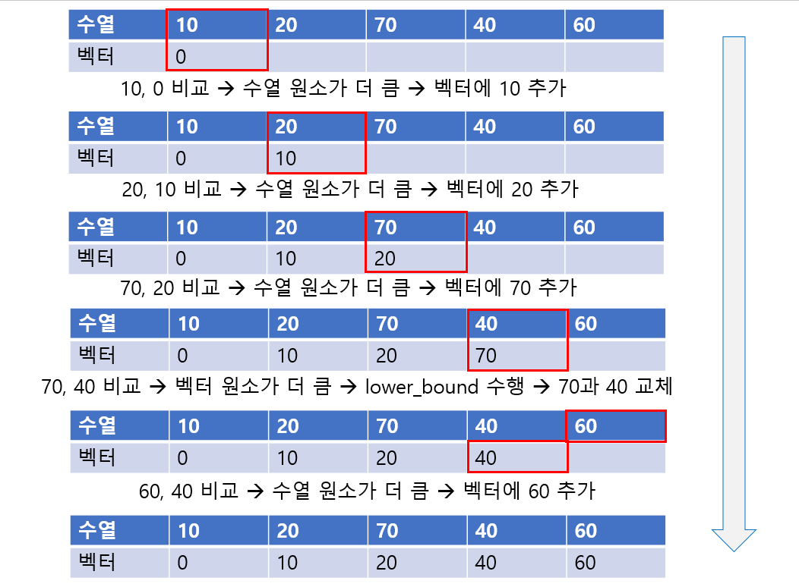

# [Algorithm] 최장 증가 부분 수열
- - -

## 최장 증가 부분 수열이란?
주어진 수열 내에서, 순차적으로 수가 증가하는 부분 수열 중 가장 길이가 긴 부분 수열을 말한다. LIS 알고리즘이라고도 하며, 이는 Longest Increasing Sequence의 약자이다.
<br/>

LIS 알고리즘을 살펴보기 위해 백준의 간단한 문제 하나를 풀이해보자.
[백준 11053번 - 가장 긴 증가하는 부분 수열](https://www.acmicpc.net/problem/11053)<br/>

## LIS 알고리즘
LIS 알고리즘에는 크게 3가지가 있다.

1. 완전 탐색
생각할 수 있는 가장 간단한 알고리즘이다. 이 방법으로 풀이할 경우, 아래와 같은 코드가 나올 수 있다.
```cpp
#include <bits/stdc++.h>
using namespace std;

int seq[1001];
int n, ans;

void solve(int index, int length) {
    ans = max(ans, length);
    for(int i=index+1; i<n; ++i) {
        if(seq[index] < seq[i])
            solve(i, length + 1);
    }
}

int main(void) {
    scanf("%d", &n);
    for(int i=0; i<n; ++i)
        scanf("%d", &seq[i]);
    
    for(int i=0; i<n; ++i)
        solve(i, 1);

    printf("%d", ans);
}
```
dfs로 가능한 모든 경우의 수를 탐색하는 코드이다. 간단하게 시간복잡도를 계산해보자.
위 코드는 맨 앞 인덱스부터 다음 인덱스의 원소가 더 클 경우 재귀 호출한다. 즉, 이 방법에서 발생할 수 있는 가장 최악의 상황은 주어진 수열 자체가 LIS가 될 수 있는 상황이다.
주어진 수열이 {1,2,3} 일 때, 완전 탐색 알고리즘은 모든 부분 수열을 검사한다. 
({1}, {2}, {3}, {1,2}, {1,3}, {2,3}, {1,2,3})
따라서, 시간복잡도는 <strong>O(2<sup>n</sup>)</strong>가 된다.
<br/>
문제에서 n은 최대 1000이므로, 대충 계산해 보아도 시간초과가 발생할 것 같다.<br/><br/>


2. 동적 계획법
완전 탐색 시 오랜 시간이 걸리는 이유는 무엇일까? 바로 **이미 했던 작업을 또 다시 하기 때문** 이다.
완전 탐색 코드에서 수열 {1,2,3} 의 부분 수열을 탐색할 때 어떤 과정을 거치는지 살펴보자.<br/>
코드 흐름 상 {1,2,3} -> {1,3} -> {2,3} -> ... 순으로 부분 수열을 찾게 된다. {1,2,3}을 찾는 과정에서, 이미 두 번째 원소 이후 몇 가지의 경우의 수가 있는지를 계산한다. 하지만 {2,3}을 찾으면서 다시 동일한 계산을 하게 되고, 이러한 중복 연산이 누적되어 비효율적인 알고리즘이 된다.<br/>
동적 계획법으로 이와 같은 시간적 비효율성을 해결할 수 있다.
동적 계획법으로 구현한 코드는 아래와 같다.
```cpp
#include <bits/stdc++.h>
using namespace std;

int dp[1001];
int seq[1001];
int n;

int solve(int start) {
    int& ret = dp[start];
    if(ret == 0) {
        for(int i=start + 1; i<=n; ++i) {
            if(seq[i] > seq[start])
                ret = max(ret, solve(i) + 1);
        }
        if(ret == 0)
            ret = 1;
    }
    return ret;
}

int main(void) {
    scanf("%d", &n);
    for(int i=1; i<=n; ++i) scanf("%d", &seq[i]);

    for(int i=1; i<=n; ++i)
        solve(i);

    int maxVal = 0;
    for(int i=1; i<=n; ++i) {
        if(maxVal < dp[i])
            maxVal = dp[i];
    }
    printf("%d", maxVal);
}
```
dp[k] == 3 은 주어진 수열의 k번째 원소부터 마지막 원소까지의 부분 수열들 중 LIS의 길이가 3임을 뜻한다. 이 정보를 저장해두면 중복된 연산을 피할 수 있고, 시간복잡도는 **O(n<sup>2</sup>)** 가 되므로 n이 1000 정도의 문제는 통과할 수 있다.
<br/><br/>

**3. 이분 탐색**
만약 n이 1,000,000 정도로 커진다면 동적 계획법으로도 시간초과를 피해갈 수 없을 것이다. 이 경우에는 어떤 알고리즘을 사용해야 할까?<br/>
lower_bound와 선형 탐색을 사용하면 **O(nlog<sup>n</sup>)** 으로 문제를 해결할 수 있다. 풀이 원리를 먼저 알아보자.

[백준 12015번 - 가장 긴 증가하는 부분 수열2](https://www.acmicpc.net/problem/12015)<br/>

이 방법은 dp배열 대신 벡터 하나를 필요로 한다. 이 벡터는 LIS를 저장하는 용도로 사용된다.
알고리즘은 간단하다. 주어진 수열을 선형 탐색하면서 현재 인덱스의 원소와 벡터의 끝 원소를 비교한다. 현재 수열 원소가 더 크다면 해당 원소를 벡터 마지막에 삽입한다. 벡터 원소가 더 크다면 벡터 내에 현재 수열 원소가 들어갈 알맞은 위치를 lower_bound를 사용하여 찾고 교체한다.
처음부터 벡터 마지막 원소와 비교해야 하기 때문에 탐색 전에 수열 원소로 주어질 수 없는 정수 (이 문제의 경우 0 이하)를 미리 넣어두어야 한다.<br/>
수열 {10, 20, 30, 50, 40, 60} 이 주어졌을 때, 이 알고리즘의 동작 흐름을 살펴보자.

<br/>

탐색이 끝나면 벡터에는 주어진 수열의 LIS가 담겨 있게 된다. 처음에 넣어둔 0을 제외한 길이가 문제의 답이 된다.<br/>
이를 코드로 표현하면 아래와 같다.<br/>

```cpp
#include <bits/stdc++.h>
using namespace std;

vector<int> longest;
int seq[1000001];
int n;

int main(void) {
    scanf("%d", &n);
    for(int i=1; i<=n; ++i) scanf("%d", &seq[i]);

    longest.push_back(-1000001);
    for(int i=1; i<=n; ++i) {
        if(longest.back() < seq[i])
            longest.push_back(seq[i]);
        else if(longest.back() > seq[i])
            *lower_bound(longest.begin(), longest.end(), seq[i]) = seq[i];
    }

    printf("%d", longest.size() - 1);
}
```

